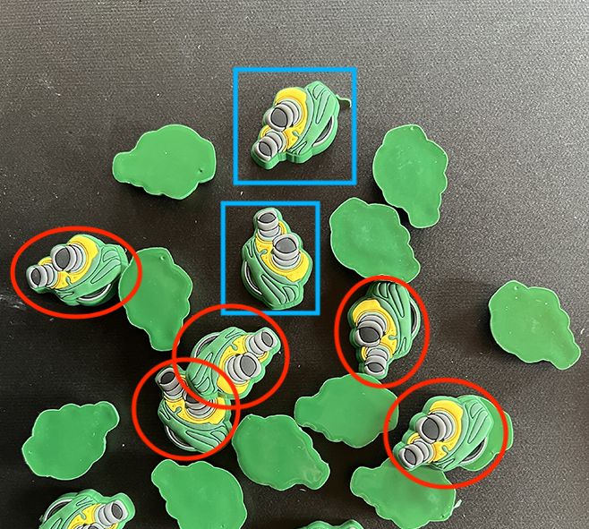
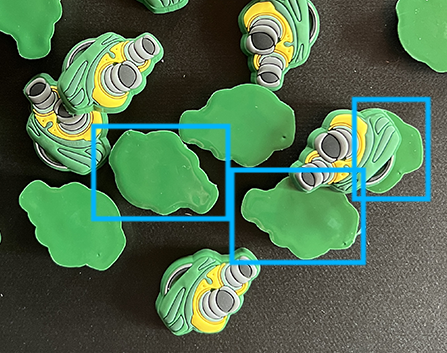

# 样本标签的确定
样本有3种标签类别，分别是：【物体正面】，【物体负面】，【不符合要求的正面】

1. 【物体正面】：这种情况很明确，符合筛求的物体才可以标注为正面物体，堆叠和过于密集的物体都不标注，下图的蓝色矩形框是有效的正面物体，红色圆形内物体不属于【正面物体】这个标签
    
   
2. 【物体反面】：这种情况仍然很明确，所有物体反面的对象都是打这个标签，包括堆叠在一起的反面物体也打这个标签，下图中蓝色矩形框的对象都是属于【物体反面】
   
    
3. 【不符合要求的正面】：这种情况比较复杂一点，总的来说就是不符合要求的正面物体。堆叠在一起的正面（和反面堆在一起也算），过于密集的正面都都属于【不符合要求的正面】标签， 下图中红色圆圈内的物体都是属于【不符合要求的正面】标签
   
    

# 标签命名规则
物体正面用“1”表示，物体反面用“2”表示，不符合要求的正面用“3”表示。控制点用`p1`，`p2`表示

# 注意事项
1. 只有【物体正面】的对象才需要标注控制点，其他的对象不需要标注控制点
2. 标注控制点时，尽量让两个控制点距离远点，且选择物体上花纹明显的区域
3. 【物体正面】的对象必须填写group_id，且每个对象的group_id都是唯一的 ，其他的对象不需要填写group_id
4. 注意“样本均衡”，检测模型只能检测出在训练的时候看过的图像，做到每一种标签的样本数量均衡，不要某一种标签的数量远多于其他种类的标签
